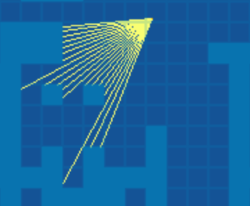
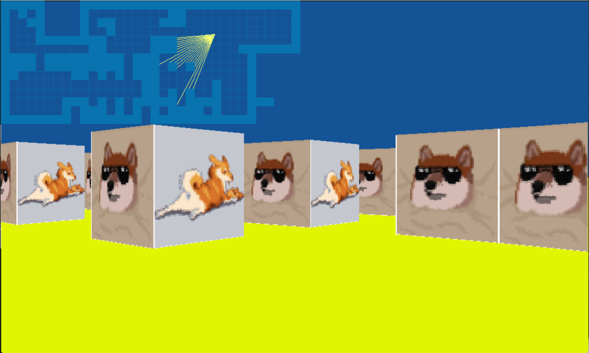
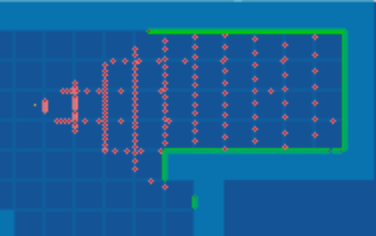
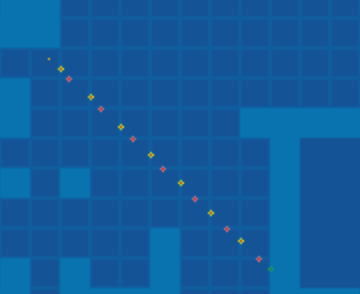

# Cube3D
Совместный геймдев проект @wyholger и @bpatrici написанный на Си.

Реализация механизма рейкастинга с помощью графической библиотеки mlx.

Рекастинг позволяет создать эмитацию 3D пространства с видом от первого лица.

Персонаж у которого есть угол обзора, бросает много лучей в рамках своего угла обзора.

Цель каждого луча вычислить расстояние от персонажа до ближайшего препятствия (например стены).

Зная это расстояние можно вычислить относительную высоту этого препятствия с учетом перспективы.

Я оптимизировал вычисленя каждого луча используя правила тригонометрии. 

Что позволило мне делать вычисление местонахождения окончания луча не каждый фиксированный шаг, а только в местах пересечения луча с вертикальной осью координат, или с горизонтальной.

Что существенно ускоряет работу программы и увеличивает точность вычислений.

Красными точками показаны места где вычисляется длина луча и узнается не долетел ли он до препятствия.

Вот визуализация вычислений для одного луча.

Желтые точки - перечечения с вертикальной осью.

Красные точки - пересечения с горизонтальной осью.

